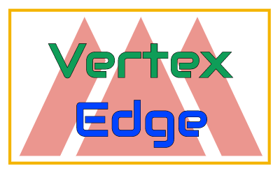

<p align="center"></a></p>
<p align="center">Connecting the Vertices on GCP</p>
<p align="center">
	</a>
    <a href="https://circleci.com/gh/fuzzylabs/vertex-edge/tree/master"></a>
</p><br/>

This repository showcases _edge_, a tool for deploying models to [Vertex](https://cloud.google.com/vertex-ai/docs/start) on [Google Cloud Platform](https://cloud.google.com). We've also provided a reference example that shows how to train and deploy a simple model to GCP, and we show how to get up-and-running with everything you need to do MLOps _right_ (in our opinion).

You can use this repo as a template for your projects. To get started, **fork this repo** and follow the instructions in this README to configure the tools for your GCP enviroment. By the end, you'll have an MLOps-ready environment with a simple model trained and deployed.

## Feedback and contributions

This is a new project and we're keen to get feedback from the community that will help us to improve it. Please do **raise and discuss issues**, send us pull requests, and don't forget to **~~like and subscribe~~** star and fork.

**If you want to contribute** then please check out our [contributions guide](CONTRIBUTING.md), and we'll look forward to contributions!

## Motivation

With this project we set out to address the following questions:

<!-- TODO: answers -->

* How do we version data?
* How would two data scientists work collaboratively on a model?
* How do we track experiments?
* How do we set up a training pipeline in the cloud?
* How do we test the model?
* How do we serve the model?
* How do other software components interact with the model?
* How do we monitor the model the model on an ongoing basis?

## Table of Contents

* **[Concepts](#concepts)** - the underlying MLOps concepts in this example.
* **[Installing on your GCP environment](#installing)**
* **[Training your first model in GCP](#running)**
* **[Setting up CI/CD with CircleCI](#circle)**

More documentation

* **[Contributing](CONTRIBUTING.md)**

<a name="concepts"></a>
# Concepts

Any productionised machine learning project will consist not only of models but other software components that are necessary in order to make those models useful. We will typically be building models along-side other pieces of software. Both of these need to be tracked, deployed, and monitored, but the approach taken for models differs somewhat from other kinds of software.

A machine learning model passes through a few stages of life. Let's look at those stages.

## Experimental phase

Imagine a team of data scientists starting a project from scratch. At this stage there are numerous unknowns, but we can still introduce some tools that will make life easier.

### The data

The data may not be well-understood, and it may be incomplete. It's important to have data version control from the very start, because:

* It's easier for a team to share data while ensuring that everybody is working with the same version of that data.
* It allows us to track changes over time.
* We can link every experiment and deployed model to a specific data version.

We use [DVC](https://dvc.org) to do data versioning. DVC has a number of other features, including pipelines, which we'll discuss next.

### The code

Ultimately we want to train a model, so we'll need to write some code as well. Code versioning is just as important as data versioning, for exactly the same reasons as stated above.

We're using Git to track code versions. It's worth noting that DVC interoperates with Git, so this single code repository is enough to get somebody up-and-running with everything they will need in order to train the model.

Training a model involves a few steps. At the very least, we must prepare data and then run a training script. We use DVC to specify a training pipeline. Something to keep in mind: we're going to be talking about two different kinds of pipeline:

* **Model training pipeline** - a DVC pipeline which first prepares the training data, and then trains a model.
* **CI / CD pipeline** - using [CircleCI](https://circleci.com) we can combine training and deployment into a single pipeline.

This admittedly gets a little bit confusing, because 'pipeline' means two different things depending on the context. The CI/CD pipeline itself runs the model training pipeline.

### Experiments

Every run of the model training pipeline gets logged to a central location. Any time we run this pipeline, we call that an experiment. In any experiment, we record:

* When it ran, who ran it, and where it ran.
* The Git commit associated with the experiment.
* The data version associated with the experiment.
* The hyperparameters in use.
* The performance of the model.

This way, anybody on the team is able to review past experiments and reproduce them consistently.

We use [Sacred](https://github.com/IDSIA/sacred) with [Omniboard](https://github.com/vivekratnavel/omniboard) for experiment tracking (MongoDB is used as the backing database). The _vertex:edge_ tool will install the experiment tracker into your GCP environment so that you can log and review experiments.

## Adding cloud training infrastructure (Vertex AI)

When it comes to training our model, we want to use cloud-based resources. This gives us more computational power, but it also centralises training and prepares us for cloud-based deployment, which will come later.

Vertex can already train models in the cloud - that's what it does best! - but we also want it to work seamlessly with data versioning and experiment tracking.

The DVC model training pipeline has two steps:

* Data preparation: generate a training and testing dataset.
* Train: execute a training script on Vertex and capture the resulting model.

## Cloud deployment infrastructure (Vertex AI)

<!-- todo -->

## Monitoring

Once a model has been deployed, we'd ideally like to monitor it. The purpose of monitoring a model is to make us aware of changes to its behaviour. Changes come for example through shifts in the input data. Additionally, we want to know about potential biases in the training data.

In response to monitoring we can make informed decisions. For instance we might decide to re-train the model with new data if we feel that this model no longer reflects reality in some way.

We haven't implemented any monitoring so far in this project, but this is something we'd like to add in the future.

## Training plus deployment: CI/CD

Finally, we want to deploy a model. We introduce CI/CD, using Circle CI, for this. A Circle pipeline itself invokes the model pipeline. The model pipeline in turn starts a training job on Vertex. It also pushes an experiment to experiment tracking, and a trained model to the Vertex model registry.

The model is deployed along with an endpoint, which exposes the model for online inference.

## Project layout

Here's a brief guide to how this project is organised:

* [data](data) - data used for our example model. This data comes from the [Fashion MNIST](https://github.com/zalandoresearch/fashion-mnist) dataset. We _don't commit the data_ to Git; DVC manages the data.
* [edge](edge) - code for the vertex:edge tool.
* [models](models) - each model has its own sub-directory under `models`, and within each model directory we have training code and the training pipeline.
* [services](services) - models by themselves aren't useful without things that interact with the model. `services` contains deployable web services that interact with models.

## Edge setup script

Finally, we come to the vertex:edge tool (`edge.py`) whose purpose is to simplify setting up a machine learning project on Google Cloud Platform from scratch.

It can:

* Run a configuration wizard and save the resulting config for future use.
* Set up all the necessary resources in GCP, namely
    * Initialise DVC in the repository.
    * Enable required Google Cloud APIs.
    * Create a Storage bucket for dataset and model storage.
    * Set up Vertex AI Endpoint for model deployment.
    * Create Kubernetes cluster and set up Sacred / Omniboard on it for experiment tracking.
* Build and push Docker images for a web app, and for model serving.
* Deploy a web app to Cloud Run.
* Deploy a trained model to Vertex AI.

Next we'll look at how to use this script to setup an MLOps-ready project in GCP.

<a name="installing"></a>
# Installing on your GCP environment

We recommend forking this repository at this point. You'll be changing configuration files, and so you'll want your own repo so you can push the changes.

## Prerequisites 

* Python 3
* [pyenv](https://github.com/pyenv/pyen)
* [gcloud command line tool](https://cloud.google.com/sdk/docs/install)
* helm - only needed if you're running the installation outside of Docker
* kubectl - only needed if you're running the installation outside of Docker

## Setup Python environment

To make collaboration go smoothly, we really want to make sure that every developer can reproduce the same development environment, which means everybody uses the same versions of Python, and the same Python dependencies.

### PyEnv

First, to manage Python, we'll use [PyEnv](https://github.com/pyenv/pyenv). Follow the instructions for your operating system; once installed, PyEnv will download and make available the appropriate version of Python for you.

The Python version for this project is kept in [.python-version](.python-version). We can install and activate this version of Python by running:

```
pyenv install
```

Now if you run `python --version` it will match what's in [.python-version](.python-version).

### Python dependencies (venv + PIP)

With the correct version of Python set up, we'll use [Python venv](https://docs.python.org/3/library/venv.html) to provide an isolated Python environment, and [PIP](https://pypi.org/project/pip) to install and manage Python dependencies.

```
python -m venv env/
source env/bin/activate
pip install -r requirements.txt
```

[comment]: <> (add pip version)

## Setting up GCP environment

Now you'll need a [GCP account](https://cloud.google.com), so sign up for one if you haven't already done so. Within your GCP account, [create a new project](https://cloud.google.com/resource-manager/docs/creating-managing-projects), or you can use an existing project if you prefer.

## Authenticate with GCP

If you haven't got the `gcloud` command line tool, [install it now](https://cloud.google.com/sdk/docs/install).

Then authenticate by running:

```
gcloud auth login
```

Followed by

```
gcloud auth application-default login
```

## Configure vertex:edge for your GCP environment

The configuration file `edge.yaml` contains all the information needed to setup tools and models in GCP. The `edge.yaml` that we've provided is only an example; you'll need to create your own.

To start the configuration wizard, run

```
./edge.py config
```

This will ask you a series of questions and then it will overwrite `edge.yaml` with your new configuration.

## Install on GCP

If you're happy with the configuration, you're now ready to install all the things:

The easiest way to do this is using Docker. First, build the image:

```
docker build -t edge
```

Then run

```
./edge_docker.sh install
```

Alternatively, if you don't want to run it in Docker, simply use

```
./edge.py install
```

## Uninstall from GCP

If for any reason you need to undo the installation, you can uninstall using

```
./edge.py uninstall
```

<a name="running"></a>
# Training your first model

<!-- todo: general explanation of what we'll train, what dataset we'll use. Mention that we're not running the training locally, it's not designed to work this way -->
So, you've forked this repository, you've configured and installed all of the tools on GCP, and finally you're ready to train a model - yay!

The model that we're going to train is based on the [Fashion MNIST](https://github.com/zalandoresearch/fashion-mnist) dataset. Some important things to remember:

* We don't store the datasets in Git, so before you can train the model, you'll need to download the dataset and initialise DVC (data version control).
* All training is done on Vertex. We currently don't support local training, i.e. running the training script on your own computer.

## Dataset seeding

We need to download the original dataset, which is simple enough. But we also want to setup data version control, and we want to ensure that the data is backed to a central location.

Having ran the installation script, you already have a Cloud Storage Bucket which will serve as the central location. We'll run two commands:

```
./seed_data.sh 
dvc push
```

The `seed_data.sh` script downloads the dataset and registers it with DVC. Then, `dvc push` will push that data up to the Cloud Storage bucket (similar to `git push`).

<!-- link to DVC docs here for remote storage management -->

[comment]: <> (* CircleCI setup)

[comment]: <> (* Running pipelines, deploying model and webapp from local machine)

## Running the training pipeline

### Pull the dataset

Start by making sure you are using the most recent data version:

```
dvc pull
```

### Build and push model serving Docker image

We need to build a custom Docker image, which will be used for serving the model. The `edge` script takes care of building and pushing this to GCP:

```
./edge.py vertex build-docker
```

### Run training pipeline

Earlier we mentioned that we use DVC to provide the model training pipeline. This pipeline will execute the model training step on Vertex:

```
dvc repro models/fashion/dvc.yaml
```

After having ran this, a custom training job will appear under https://console.cloud.google.com/vertex-ai/training/custom-jobs.

<!-- TODO: add docs link for DVC pipelines -->

## Viewing experiments with the experiment tracker

Each run of the training pipeline gets logged to the experiment tracker. To view experiments, you'll first need to get the dashboard URL:

```
./edge.py omniboard
```

If you visit this URL in a browser you will see the history of all experiments.

## Deploying the trained model

You can now deploy the trained model to Vertex:

```
./edge.py vertex deploy
```

Having ran this, a model will be available under https://console.cloud.google.com/vertex-ai/models

## Using the demo web app

The demo web app is a simple web application that is intended to work with the fashion model that we trained before. There are two ways to run it: you can run it in Docker locally, or deploy it to GCP Cloud Run.

### Run locally in docker

```
./edge.py webapp run
```

### Deploy to Cloud Run

```
./edge.py webapp build-docker
./edge.py webapp deploy
```

<a name="circle"></a>
# CircleCI setup

## Activate project in CircleCI

Follow [the instructions](https://circleci.com/docs/2.0/getting-started/?section=getting-started#setting-up-circleci)

## Add Google Cloud service account 

Follow [the instructions](https://circleci.com/docs/2.0/google-auth/#creating-and-storing-a-service-account)

This service account must have the following roles:

* Vertex AI user
* Service Account User
* Cloud Run Admin
* Secret Manager Secret Accessor
* Storage Admin
* GKE admin
